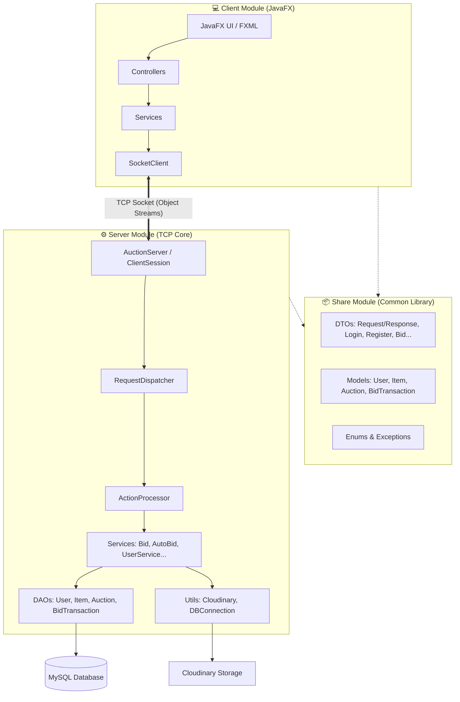

# 🔨 HanoiBid - Hệ thống Đấu giá Trực tuyến Thời gian thực (Real-time Auction System)

[](https://openjdk.org/)
[](https://openjfx.io/)
[](https://maven.apache.org/)
[](https://www.mysql.com/)
[](https://cloudinary.com/)

**HanoiBid** là một hệ thống đấu giá trực tuyến phân tán (Distributed Auction System) được thiết kế theo mô hình **Client-Server** với kiến trúc đa mô-đun (Multi-module Maven). Dự án sử dụng kết nối **TCP Socket** bền vững cùng luồng dữ liệu đối tượng (`ObjectOutputStream` & `ObjectInputStream`) để tối ưu hóa khả năng cập nhật thời gian thực (Real-time synchronization), đồng thời trang bị hệ thống tự động đấu giá (**Auto-bid**) thông minh, đa luồng và an toàn giao dịch.

---

## 📐 Kiến trúc Hệ thống

Dự án được phân rã thành **3 mô-đun chính** nhằm tối ưu tính tái sử dụng mã nguồn và quản lý phụ thuộc hiệu quả:



---

## 📂 Cơ cấu Thư mục Dự án

```text
Project_BidSystem/
├── share/                  # Thư viện dùng chung (Models, DTOs, Enums, Exceptions)
│   └── src/main/java/com/auction/share/
│       ├── DTO/            # Đối tượng truyền tải dữ liệu giữa Client <-> Server
│       ├── enums/          # Các bộ Enum định nghĩa vai trò, trạng thái, danh mục
│       ├── exceptions/     # Các Exception tùy chỉnh phục vụ validate hệ thống
│       └── models/         # Các thực thể dữ liệu (User, Bidder, Seller, Item, Auction,...)
│
├── server/                 # Socket Server (Xử lý logic, JDBC, luồng và DB)
│   ├── src/main/java/com/auction/server/
│   │   ├── controller/     # Điều hướng và xử lý Request qua RequestDispatcher & ActionProcessor
│   │   ├── dao/            # Data Access Object quản lý thao tác MySQL qua JDBC thuần
│   │   ├── mapper/         # Bản đồ ánh xạ dữ liệu từ DB sang Model/DTO
│   │   ├── network/        # Khởi tạo TCP Server, lắng nghe ClientSession & quản lý Registry
│   │   ├── service/        # Nghiệp vụ: Đấu giá, Đấu giá tự động (Auto-bid), Giao dịch, Đồng bộ
│   │   └── util/           # Tiện ích: Mã hóa jBCrypt, Kết nối HikariCP, Cloudinary SDK
│   └── Dockerfile          # Cấu hình container hóa ứng dụng Server
│
├── client/                 # Ứng dụng Client GUI (JavaFX & FXML)
│   ├── src/main/java/com/auction/client/
│   │   ├── controller/     # Điều khiển các cửa sổ giao diện (Login, Home, Dashboard, Detail...)
│   │   ├── factory/        # Mẫu thiết kế Factory quản lý giao diện thích ứng theo vai trò (Role UI)
│   │   ├── network/        # Quản lý SocketClient kết nối lâu dài, lắng nghe sự kiện push đẩy về
│   │   └── service/        # Các service giao tiếp với Server thông qua Socket
│   └── src/main/resources/com/auction/client/view/ # Chứa các file FXML & Graphic Assets
│
└── pom.xml                 # File cấu hình Maven cha (Root POM)
```

---

## 🌟 Các Tính năng Nổi bật

### 1. Đồng bộ và Cập nhật Thời gian thực (Real-time Pushing)
* Thay vì sử dụng cơ chế kéo dữ liệu liên tục (Polling) gây lãng phí băng thông, HanoiBid thiết lập cổng **TCP socket bền vững** (`persistent TCP socket connection`).
* Khi một tài khoản thực hiện bid (đặt giá), sự kiện sẽ lập tức được hệ thống phân phát thông qua `BidBroadcastService` và `AuctionSubscriptionRegistry` đến toàn bộ những Client đang xem phiên đấu giá đó chỉ trong mili-giây.

### 2. Bộ điều phối Đấu giá & Tự động Đấu giá Thông minh (Auto-Bid Coordinator)
* Hệ thống tích hợp tính năng **Auto-Bid** cực kỳ tối ưu: cho phép người mua thiết lập mức ngân sách tối đa và bước giá mong muốn.
* Được thiết kế đa luồng an toàn (`thread-safe`), lớp `BidCoordinator` điều phối tuần tự giữa đấu giá thủ công của người chơi khác và thuật toán đấu giá tự động của robot, đảm bảo nguyên tắc công bằng, loại bỏ xung đột Race Condition.
* Hệ thống tự động kích hoạt gia hạn thời gian thêm **30 giây** nếu xuất hiện lượt trả giá mới trong vòng **10 giây** cuối cùng trước khi phiên đóng (Snipe Protection).

### 3. Giao dịch Cơ sở Dữ liệu Toàn vẹn (Database ACID)
* Toàn bộ thao tác trừ tiền tài khoản người thắng cuộc (`deductWinningBidders`), cộng tiền cho người bán (`creditSellers`), hay đặt tiền tạm giữ đều được bọc trong các **Database Transactions** của JDBC.
* Áp dụng cơ chế **Pessimistic Locking** (`SELECT ... FOR UPDATE`) khi kiểm tra số dư và cập nhật giá cao nhất nhằm triệt tiêu hoàn toàn khả năng người chơi mua quá số dư khả dụng (Double Spending).

### 4. Giao diện Thích ứng Theo Vai trò (Dynamic Role-based GUI)
* Áp dụng **Factory Pattern** (`RoleUIFactory`, `BidderUIFactory`, `SellerUIFactory`) để sinh giao diện người dùng động dựa trên quyền hạn đăng nhập:
  * **Bidder (Người Mua):** Màn hình chính tìm kiếm, bộ lọc theo phân loại, tham gia đấu giá trực tiếp, quản lý lịch sử đặt giá và số dư.
  * **Seller (Người Bán):** Dashboard theo dõi doanh thu, tạo mới vật phẩm (tải ảnh trực tiếp lên đám mây), thiết lập cấu hình giá sàn và bước giá.
  * **Admin (Quản trị viên):** Cấp quyền quản lý nâng cao.

---

## 🛠️ Công nghệ Sử dụng

### **Phần mềm Client:**
* **JavaFX 21** & **FXML** làm nền tảng xây dựng GUI.
* Kiến trúc MVC phân tách rõ rệt vai trò Controller và View.

### **Máy chủ Server:**
* **Java SE 17** với Socket API đa luồng.
* **HikariCP** - Bộ quản lý kết nối cơ sở dữ liệu (Connection Pool) hiệu năng cao nhất thế giới Java.
* **jBCrypt** mã hóa băm mật khẩu một chiều an toàn chống tấn công Brute-force.
* **Dotenv Java** hỗ trợ cấu hình biến môi trường cục bộ thông qua file `.env`.
* **Cloudinary Java SDK** tích hợp API lưu trữ ảnh đám mây trực tiếp.

### **Cơ sở Dữ liệu:**
* **MySQL 8.0** lưu trữ dữ liệu quan hệ chặt chẽ.

---

## 📋 Thiết kế Cơ sở Dữ liệu (Schema)

Dưới đây là cấu trúc bảng đầy đủ cho CSDL **MySQL** của dự án:

```sql
-- 1. Bảng Users (Chứa Người mua, Người bán và Admin)
CREATE TABLE users (
    id VARCHAR(36) PRIMARY KEY,
    fullname VARCHAR(255) NOT NULL,
    username VARCHAR(100) UNIQUE NOT NULL,
    password VARCHAR(255) NOT NULL,
    phoneNumber VARCHAR(20),
    email VARCHAR(100) UNIQUE,
    role VARCHAR(20) NOT NULL, -- 'BIDDER', 'SELLER', 'ADMIN'
    balance DOUBLE DEFAULT 0.0,
    address VARCHAR(255),
    access_level INT DEFAULT 0
);

-- 2. Bảng Items (Vật phẩm đấu giá)
CREATE TABLE items (
    id VARCHAR(36) PRIMARY KEY,
    seller_id VARCHAR(36) NOT NULL,
    name VARCHAR(255) NOT NULL,
    category VARCHAR(50) NOT NULL, -- 'ITEM', 'ANTIQUE', 'ART', 'ELECTRONIC', 'JEWELRY', 'REALESTATE', 'VEHICLE'
    starting_price DOUBLE NOT NULL,
    description TEXT,
    image_url VARCHAR(500),
    FOREIGN KEY (seller_id) REFERENCES users(id) ON DELETE CASCADE
);

-- 3. Bảng Auctions (Phiên đấu giá)
CREATE TABLE auctions (
    id VARCHAR(36) PRIMARY KEY,
    item_id VARCHAR(36) NOT NULL,
    seller_id VARCHAR(36) NOT NULL,
    current_price DOUBLE NOT NULL,
    highest_bidder_id VARCHAR(36),
    start_time TIMESTAMP NOT NULL,
    end_time TIMESTAMP NOT NULL,
    bid_step DOUBLE NOT NULL,
    status VARCHAR(20) NOT NULL, -- 'OPEN', 'RUNNING', 'FINISHED', 'CANCELED'
    bid_count INT DEFAULT 0,
    FOREIGN KEY (item_id) REFERENCES items(id) ON DELETE CASCADE,
    FOREIGN KEY (seller_id) REFERENCES users(id) ON DELETE CASCADE,
    FOREIGN KEY (highest_bidder_id) REFERENCES users(id) ON DELETE SET NULL
);

-- 4. Bảng Bid Transactions (Lịch sử giao dịch đặt giá)
CREATE TABLE bid_transactions (
    id VARCHAR(36) PRIMARY KEY,
    auction_id VARCHAR(36) NOT NULL,
    bidder_id VARCHAR(36) NOT NULL,
    amount DOUBLE NOT NULL,
    timestamp TIMESTAMP DEFAULT CURRENT_TIMESTAMP,
    FOREIGN KEY (auction_id) REFERENCES auctions(id) ON DELETE CASCADE,
    FOREIGN KEY (bidder_id) REFERENCES users(id) ON DELETE CASCADE
);
```

---

## 🚀 Hướng dẫn Cài đặt & Chạy Dự án

> [!NOTE]
> Yêu cầu hệ thống đã cài đặt sẵn **JDK 17** (hoặc cao hơn) và công cụ build **Maven**.

### Bước 1: Khởi tạo Cơ sở dữ liệu
1. Đăng nhập vào trình quản trị MySQL của bạn (MySQL Workbench, phpMyAdmin, CLI,...).
2. Tạo mới một cơ sở dữ liệu có tên là `auction_db`:
   ```sql
   CREATE DATABASE auction_db CHARACTER SET utf8mb4 COLLATE utf8mb4_unicode_ci;
   ```
3. Chạy đoạn Script tạo bảng ở mục **[Thiết kế Cơ sở Dữ liệu]** phía trên để sinh cấu trúc bảng.

### Bước 2: Cấu hình Môi trường Server
Tại thư mục **`server/`** (hoặc thư mục gốc dự án), tạo một file có tên là `.env` để cấu hình kết nối DB và API Cloudinary:

```env
# Database Credentials
DB_URL=jdbc:mysql://localhost:3306/auction_db?useSSL=false&allowPublicKeyRetrieval=true&serverTimezone=UTC
DB_USER=your_mysql_username
DB_PASS=your_mysql_password

# Server Settings
PORT=8080

# Cloudinary Storage Configuration (Sử dụng 1 trong 2 cách dưới đây)
# Cách 1: Sử dụng URL tích hợp
CLOUDINARY_URL=cloudinary://<API_KEY>:<API_SECRET>@<CLOUD_NAME>

# Cách 2: Hoặc nhập riêng lẻ từng thông số
CLOUDINARY_CLOUD_NAME=your_cloud_name
CLOUDINARY_API_KEY=your_api_key
CLOUDINARY_API_SECRET=your_api_secret
```

### Bước 3: Cấu hình Địa chỉ Kết nối cho Client
Nếu bạn muốn chạy Client kết nối tới Server local thay vì Server môi trường Staging hiện tại:
1. Mở file [ClientContext.java](file:///d:/Project_BidSystem/client/src/main/java/com/auction/client/ClientContext.java).
2. Thay đổi các biến cấu hình trỏ về localhost:
   ```java
   private static final String SERVER_HOST = "127.0.0.1";
   private static final int SERVER_PORT = 8080;
   ```

### Bước 4: Biên dịch ứng dụng
Từ thư mục gốc dự án `Project_BidSystem/`, chạy lệnh Maven để dọn dẹp và đóng gói tất cả các mô-đun:
```bash
mvn clean install
```

### Bước 5: Chạy Máy chủ Server
Sau khi biên dịch thành công, di chuyển vào thư mục mô-đun `server/` và khởi chạy máy chủ:
```bash
cd server
mvn exec:java -Dexec.mainClass="com.auction.server.ServerApplication"
```
*Hoặc khởi chạy ứng dụng Server bằng Docker:*
```bash
docker build -t auction-server .
docker run -p 8080:8080 --env-file server/.env auction-server
```

### Bước 6: Khởi chạy Ứng dụng Client
Mở một Terminal mới, di chuyển đến thư mục mô-đun `client/` và chạy lệnh sau để mở giao diện JavaFX:
```bash
cd client
mvn javafx:run
```

---

## 🔒 Bản quyền & Bảo mật

* Dự án áp dụng các kỹ thuật mã hóa và lưu trữ mật khẩu an toàn sử dụng **jBCrypt**.
* Hệ thống ngăn chặn tấn công **Race Condition** trên số dư ví của khách đặt giá nhờ kiến trúc kiểm tra khóa bi quan cấp CSDL (`FOR UPDATE`).
* Mọi hành vi tải dữ liệu tệp được định danh trực tiếp qua UUID và được làm sạch ký tự trước khi lưu trữ đám mây.

---
*Chúc bạn có những phiên đấu giá thành công và trải nghiệm mượt mà cùng **HanoiBid**!* 🚀
